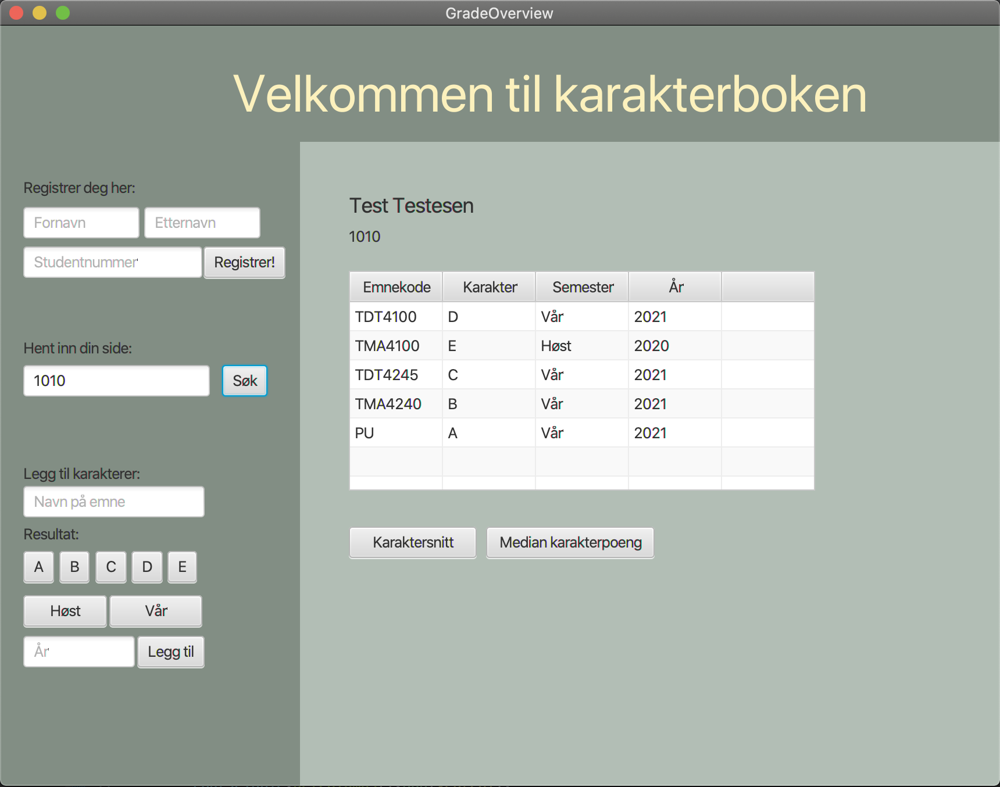

# Prosjekt-repo for TDT4100

Dette prosjektet er en innlevering i emnet TDT4100 Objektorientert programmering ved NTNU, og står for 35% av sluttkarakteren i faget. 
Det er et selvstendig arbeid gjort av Emily Kate Marie Blakseth våren 2021.

Applikasjonen er bygget etter Model, View, Controller prinsippet. 
I applikasjonen har jeg brukt Java, JavaFX for GUI og JUnit5 for testing.

Applikasjonen er en karakterbok med støtte for flere studenter, hvor hver student kan registrere seg, logge inn og registrere ulike emner. Applikasjonen har en tabell med oversikt over studentens emner, semesteret og året det ble tatt, samt karakter. Studenten kan også se sitt karaktersnitt og sin mediankarakter.

Applikasjonen lagrer dataene lokalt i en fil, som blir hentet inn ved oppstart av applikasjonen og lagres automatisk ved endringer.

